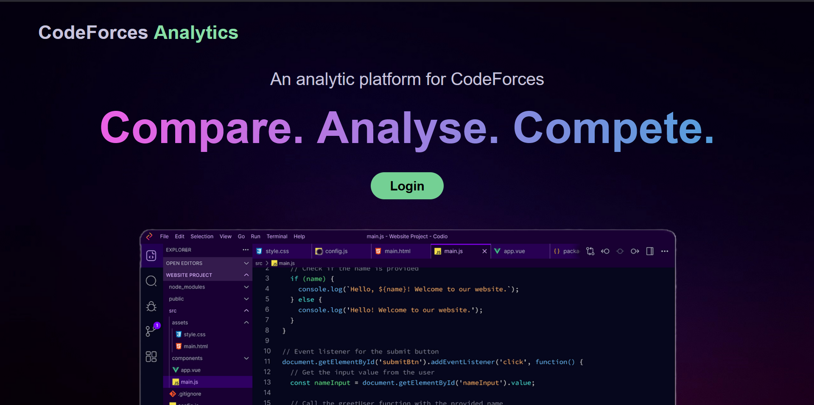
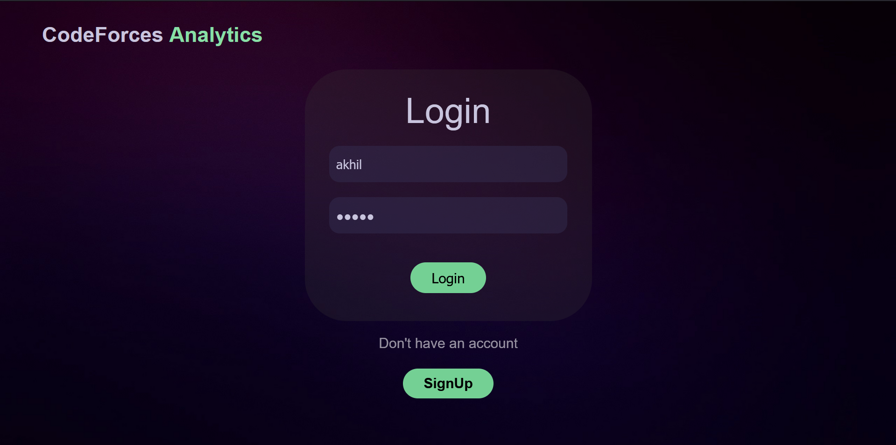
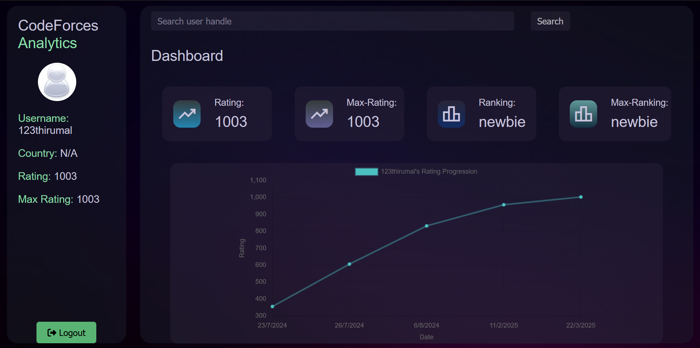
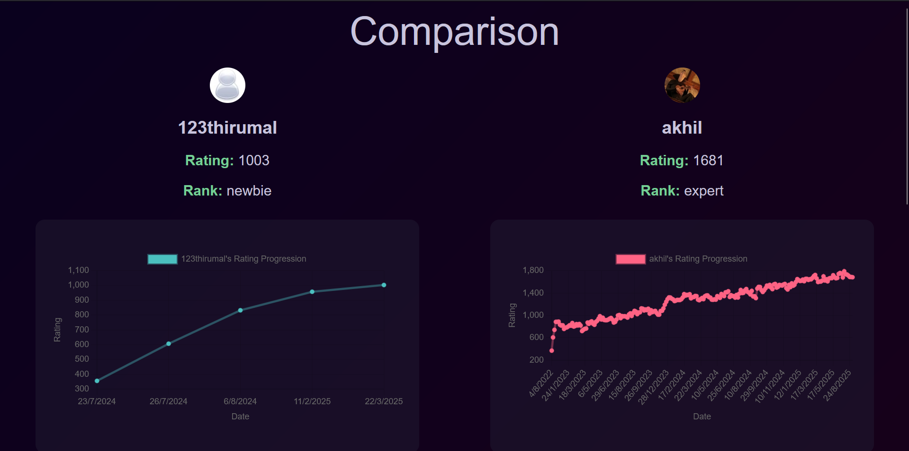
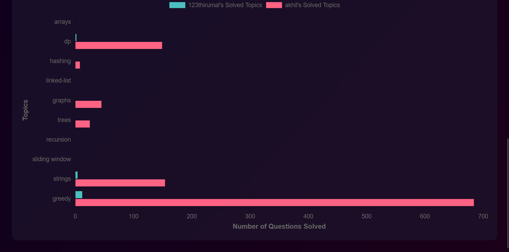

# 📊 Codeforces Analytics

Codeforces Analytics is a **web application** built with **ReactJS (frontend)** and **Django (backend)**.  
It allows users to log in using their **Codeforces credentials** and provides powerful insights into their competitive programming journey.  

---

## ✨ Features

- 🔑 **Login with Codeforces**  
- 📈 **Performance Analysis** (ratings, solved problems, difficulty trends)  
- 📚 **Topic Coverage**  
- 🤝 **User Comparison**  
- 📊 **Interactive Visualizations**  

---

## 🏗️ Tech Stack

- **Frontend:** ReactJS  
- **Backend:** Django (Python)  
- **Database:** PostgreSQL  
- **API:** Codeforces Public API  

---

## ⚙️ How It Works

1. User logs in with their **Codeforces handle**.  
2. The **Django backend** fetches data from the **Codeforces API**.  
3. The **React frontend** visualizes insights such as rating history, problem difficulties, and topics.  
4. Users can compare their performance with friends and other Codeforces users.  

---

### Screenshots 
 
 




---
## 🚀 Getting Started

### 1. Clone the repository
```bash
git clone https://github.com/your-username/codeforces-analytics.git
